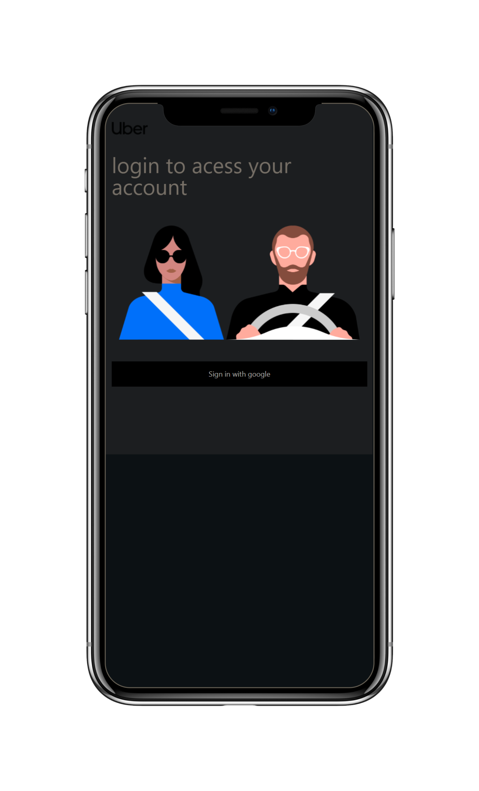
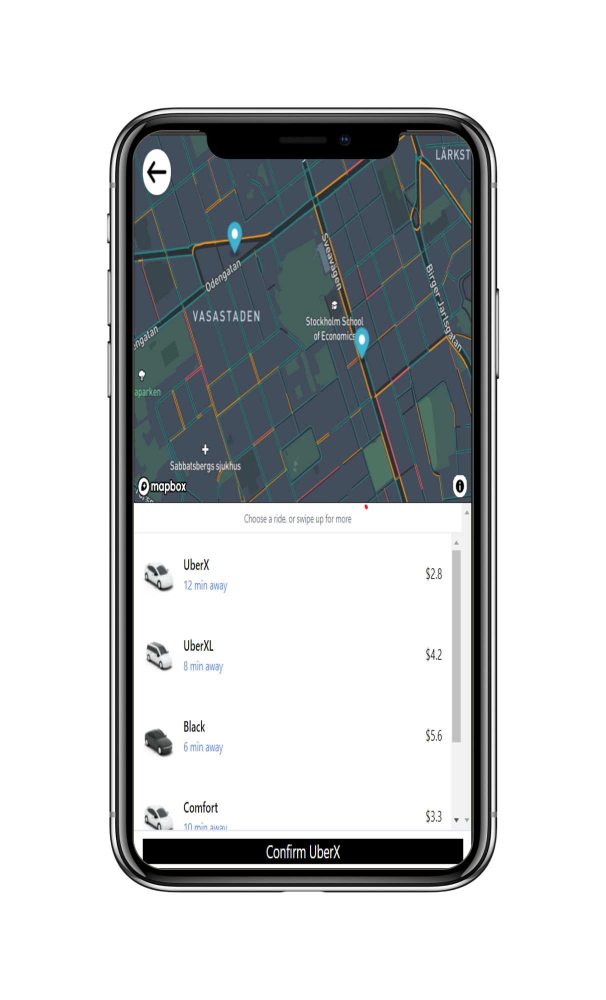
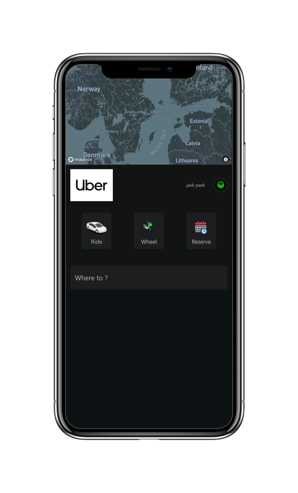

 <h4 align="center" >
 Uber Next Clone
</h4>

 <h2 align = 'center'>Screens: </h2>
<p align="center">

    
 

</p>


<p align="center">
  <a href="https://wa.me/+46793351364?text=tja%20Jakob%20jag%20gillade%20din%20Next-Uber%20Clone%20">Contact   |   </a>
  <a href="https://www.youtube.com/watch?v=_VuGmykVgTg">Inspiration</a>
</p>


## Getting Started

```bash
npm run dev
# or
yarn dev
```

This is a [Next.js](https://nextjs.org/) project bootstrapped with [`create-next-app`](https://github.com/vercel/next.js/tree/canary/packages/create-next-app).


